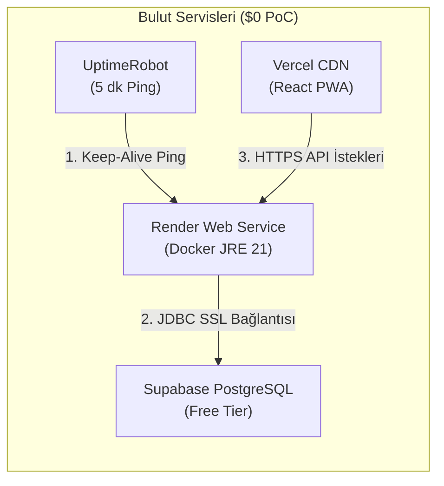

# Akıllı Saha CRM - Faz 3: Canlıya Dağıtım ve DevOps Kılavuzu ($0 PoC)

Bu kılavuz, **1. Kişi (Product Owner & DevOps)** için hazırlanmıştır. Projenin **0 TL altyapı maliyetiyle** canlıya alınmasını, Render'ın uyku modunun (cold start) engellenmesini ve müşteri demolarına hazır hale getirilmesini adım adım açıklar.

---

## 1. Mimari Dağıtım Şeması



---

## 2. Adım Adım Canlıya Çıkış Talimatları

### Adım 1: Supabase PostgreSQL Kurulumu ($0)
1. [supabase.com](https://supabase.com) adresine gidin ve ücretsiz hesap açın.
2. **New Project** butonuna tıklayın:
   * **Name**: `crm-akilli-saha`
   * **Database Password**: Güçlü bir şifre belirleyin ve not edin (Örn: `SupabaseCrm2026!`).
   * **Region**: `Frankfurt (Central EU)` (Düşük gecikme süresi için).
3. Sol menüden **Project Settings -> Database** bölümüne gelin:
   * **Connection String -> URI** sekmesini seçin.
   * `Mode: Transaction` veya `Session` (Port `6543` veya `5432`).
   * Bağlantı adresi şu şekildedir:
     ```text
     jdbc:postgresql://aws-0-eu-central-1.pooler.supabase.com:6543/postgres?sslmode=require
     ```
   * Kullanıcı adı: `postgres.<proje-ref-id>`
   * Parola: Adım 2'de belirlediğiniz parola.

---

### Adım 2: Render.com Web Service Dağıtımı ($0)

Proje kök dizininde bulunan [render.yaml](file:///Users/hdayi/Desktop/crm/CRM-akilli-saha-asistani/render.yaml) dosyası sayesinde tek tıkla kurulum yapabilirsiniz:

#### Yöntem A: Blueprint (Tek Tıkla Otomatik)
1. [render.com](https://render.com) adresine gidin.
2. **Blueprints -> New Blueprint Instance** seçeneğini tıklayın.
3. GitHub reponuzu seçin (`CRM-akilli-saha-asistani`).
4. Render, `render.yaml` dosyasını otomatik algılayacaktır.
5. Sorulan `DB_URL`, `DB_USER` ve `DB_PASSWORD` alanlarına Supabase bilgilerinizi girin.
6. **Apply** butonuna basarak dağıtımı başlatın.

#### Yöntem B: Manuel Web Service
1. **New -> Web Service** seçin.
2. GitHub reponuzu bağlayın.
3. **Runtime**: `Docker` seçin.
4. **Dockerfile Path**: `backend/Dockerfile`
5. **Docker Build Context**: `backend`
6. **Environment Variables** (Çevre Değişkenleri) sekmesine şu değerleri ekleyin:
   * `SPRING_PROFILES_ACTIVE`: `prod`
   * `DB_URL`: `jdbc:postgresql://<supabase-adresi>:6543/postgres?sslmode=require`
   * `DB_USER`: `postgres.<proje-id>`
   * `DB_PASSWORD`: `<supabase-sifreniz>`
   * `JWT_SECRET`: `404E635266556A586E3272357538782F413F4428472B4B6250645367566B5970`
   * `FRONTEND_URL`: `https://akilli-saha-crm.vercel.app`
7. **Create Web Service** butonuna basın.

> **Not:** Uygulama ilk ayağa kalktığında **Flyway** devreye girecek, 7 tabloyu, indeksleri ve tohum kullanıcıları (`admin@akillisaha.com`, `temsilci@akillisaha.com`) saniyeler içinde otomatik olarak oluşturacaktır.

---

### Adım 3: Katman 9 - UptimeRobot Keep-Alive Kurulumu ($0)

Render ücretsiz katmanında 15 dakika boyunca HTTP isteği gelmezse sunucu uyku moduna (spin-down) geçer ve sonraki istekte 50 saniyelik gecikme (cold start) yaşanır. Bunu engellemek için:

1. [uptimerobot.com](https://uptimerobot.com) adresine gidin ve ücretsiz hesap açın.
2. **Add New Monitor** butonuna tıklayın:
   * **Monitor Type**: `HTTP(s)`
   * **Friendly Name**: `Akilli Saha CRM Backend Keep-Alive`
   * **URL (or IP)**: `https://<render-servis-adiniz>.onrender.com/actuator/health`
   * **Monitoring Interval**: `5 minutes` (5 dakikada bir)
3. **Create Monitor** butonuna basın.

Artık sistem 7 gün 24 saat uyanık kalacak, plasiyerler arabada veya müşteri kapısında uygulamayı açtığında beklemeden hemen giriş yapacaktır!

---

### Adım 4: Canlı Smoke Test ve Doğrulama

Dağıtım tamamlandıktan sonra sistemin uçtan uca çalışıp çalışmadığını terminalden tek satırla test edin:

```bash
# Canlı Render sunucunuzun adresini vererek çalıştırın
./scripts/canli_smoke_test.sh https://<render-servis-adiniz>.onrender.com
```

Bu betik otomatik olarak:
1. `/actuator/health` kontrolü yapar.
2. Swagger UI (`/swagger-ui.html`) erişimini dener.
3. Yönetici ve Plasiyer hesaplarıyla sisteme giriş yapıp JWT token alır.
4. Temsilcinin yetkili olduğu firmaları ve yaklaşan ziyaret randevularını listeler.
5. 17 kolonluk Excel dışa aktarım motorunu çalıştırıp gerçek `.xlsx` çıktısını doğrular.

---

### Adım 5: Satış Kapandığında Azure Kurumsal (Enterprise) Geçişi

Ürün müşteriye başarıyla sunulup sözleşme imzalandığında, Java backend kodunda **tek bir satır dahi değiştirilmeden** Azure ortamına geçiş yapılır:

| Konfigürasyon Parametresi | $0 PoC Değeri (Canlı) | Azure Enterprise Değeri |
| :--- | :--- | :--- |
| `DB_URL` | Supabase URL | `jdbc:postgresql://crm-prod.postgres.database.azure.com:5432/crmdb` |
| `DB_USER` | `postgres.<id>` | `azure_crm_admin` |
| `DB_PASSWORD` | Supabase şifresi | `${AZURE_KEY_VAULT_DB_SECRET}` |
| `JWT_SECRET` | 256-bit Hex Anahtar | `${AZURE_KEY_VAULT_JWT_SECRET}` |
| `FRONTEND_URL` | Vercel CDN | `https://saha.sirketiniz.com` (Özel Alan Adı) |
| Barındırma | Render Web Service | **Azure Container Apps** |
